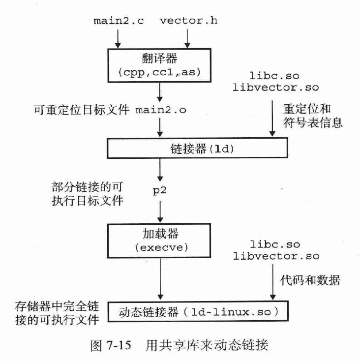
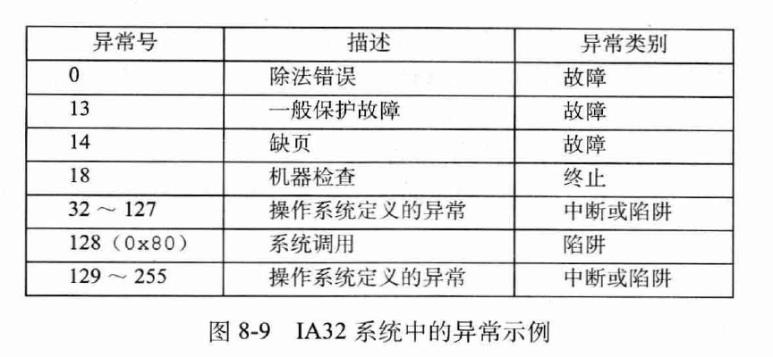
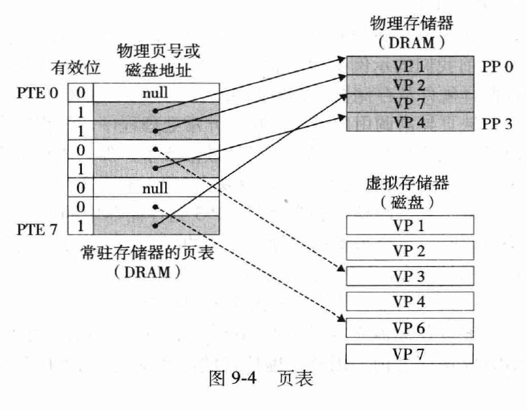
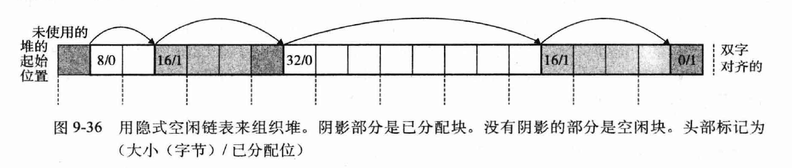
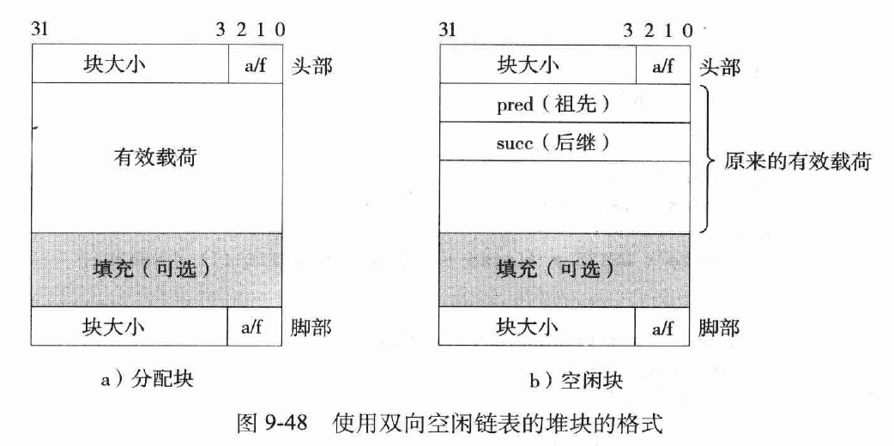
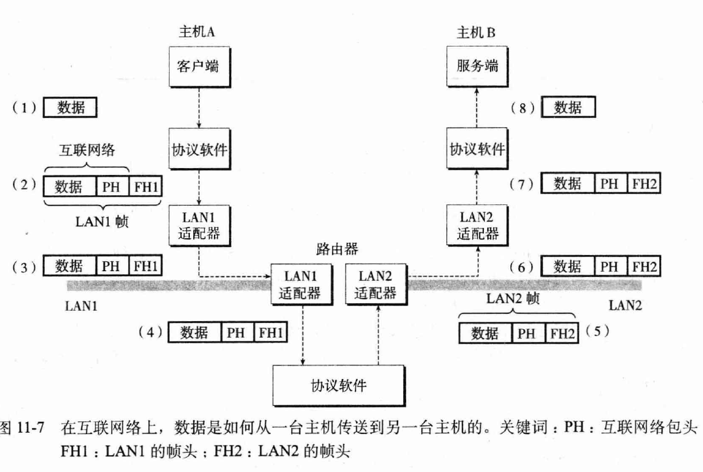

# 深入理解计算机系统

## 6. 存储器层次结构

随机访问存储器（RAM）分为静态（SRAM）和动态（DRAM），SRAM更快但更贵，常用作告诉缓存，DRAM常用作主存。RAM是易失的，即断电会丢失它们的信息。

只读存储器（ROM）则为非易失存储器。

闪存也是一种非易失存储器，固态硬盘SSD就是一种基于闪存的磁盘驱动器。

## 7. 链接

编译器驱动程序：

main.c -> C预处理器 -> main.i -> C编译器 -> ASCII码汇编语言文件：main.s -> 汇编器 -> 可重定位目标文件：main.o -> 链接器 -> 与其他必要的目标文件组合起来，得到可执行文件

静态链接：以一组可重定位目标文件和命令行参数为输入，生成可加载和运行的目标文件。

主要两个任务：
1. 符号解析：将符号引用和符号定义联系起来
2. 重定位：把符号定义与存储器位置联系起来，再使符号引用指向这个存储器位置

目标文件有三种形式：
1. 可重定位目标文件：可在编译时与其他可重定位目标文件合并，创建可执行目标文件
2. 可执行目标文件：可以被直接拷贝到存储器并执行
3. 共享目标文件：特殊的可重定位目标文件，可在加载或运行时动态加载到存储器并链接

每个可重定位目标模块m都有一个符号表，包含其定义和引用的模块信息。有三种不同的符号：
1. 由m定义并能被其他模块引用的全局符号
2. 由其他模块定义并被m引用的全局符号
3. 只被m定义和引用的本地符号

C++和java能使用重载函数，是因为编译器将每一个唯一的方法和参数列表组合编码成一个对链接器来说唯一的名字。

重定位由两步组成：
1. 重定位节和符号定义：链接器将所有相同类型的节合并为一个新的聚合节，并将运行时存储器地址赋给新的聚合节。从而程序的每个指令和变量都有唯一的运行时地址。
2. 重定位节中的符号引用：修改代码节和数据节中对每个符号的引用，使其指向正确的运行时地址。这一步依赖于**重定位条目**:(当汇编器遇到对最终位置未知的目标引用，就会生成一个重定位条目。)。

链接方式：
- 将所有标准C函数都放在一个单独的可重定位目标模块中
  - 每个可执行文件都将包含一份标准函数集合的完全拷贝
  - 对标准函数的任一修改，都要重新编译整个源文件

- 为每个标准函数创建一个独立的可重定位文件，把它们放到一个目录中
  - 要求程序员显式地链接合适的目标模块
- 相关的多个函数被编译为独立的目标模块，封装成一个单独的静态库文件
  - 多进程中会重复包含一些库文件
- 共享库：是一个目标模块，在运行时可以加载到任意的存储器地址，并和存储器中的程序链接起来。该过程称为动态链接。共享库在Unix中常用.so后缀表示。
  - 一个共享库可以被不同的正在运行的进程共享。

<div align="center">

</div>


> 多个进程如何共享共享库的一个拷贝呢？

1. 给每个共享库预备一个专用的地址空间，要求加载器总在该位置加载共享库。 -> 难以管理
2. 编译库代码，使得不需要链接器修改库代码就可以在任何地址加载和执行这些代码，称为位置无关代码PIC。


## 8.异常控制流

**异常**：控制流中的突变，用来相应处理器状态的某些变化。

- 系统中每种类型的异常都分配了一个唯一的非负整数的异常号。
- 系统启动时，初始化异常表，其中条目k包含异常k的处理程序的地址。
- 异常表起始地址放在一个叫异常表基址寄存器中。

异常的类别：
1. 中断：来自处理器外部I/O设备的信号的结果
2. 陷阱：执行一条指令的结果，如系统调用
3. 故障：由错误情况引起，如缺页异常
4. 终止：不可恢复的致命错误造成的结果，通常是一些硬件错误

<div align="center">

</div>

一个逻辑流在执行时间上与另一个流重叠，称为并发流 (concurrent flow)。
如果两个流并发的运行在不同的处理器核或计算机上，称为并行流 (parallel flow)。

操作系统通过上下文切换的异常控制流来实现多任务。内核为每一个进程维持一个上下文，上下文由一些对象的值组成，包括各种寄存器，用户栈，内核栈等。

硬件高速缓存存储器通常不能与中断和上下文切换这样的异常控制流很好的交互。从而造成高速缓存污染。即切换上下文后，以及切换回来高速缓存是冷的。

信号是一条小消息，它通知进程系统中发生了一个某类型的事件。
- 发送信号：内核通过更新目的进程上下文中的某个状态。一般有两个原因：1. 内核检测到一个系统事件，如被零除或子进程终止；2. 一个进程调用了kill函数，显式要求内核发送信号给目的进程。
- 接收信号：进程可以忽略，终止或执行信号处理程序。


非本地跳转（nonlocal jump）：将控制直接从一个函数转移到另一个正在执行的函数，而不需要进过正常的调用返回序列。通过setjmp和longjmp函数提供。

setjmp函数在env缓冲区中保存当前调用环境，以供后面的longjmp使用，并返回0。调用环境包括 程序计数器，栈指针和通用目的寄存器。longjmp函数从env缓冲区中恢复调用环境，触发一个从最近一次初始化env的setjmp调用的返回。然后setjmp返回，并带有非0的返回值。

setjmp函数只被调用一次，却被返回多次：一次是当第一次调用setjmp时，一次是为每个longjmp调用。

C++和Java中的异常机制是高层次的，是C语言setjmp和longjmp函数的更加结构化的版本。try语句中的catch子句可以类似于setjmp，throw语句类似于longjmp。

## 9. 虚拟存储器

虚拟存储器提供了三个重要能力：
1. 将主存看成是一个存储在磁盘上的地址空间的高速缓存
2. 为每个进程提供一致的地址空间
3. 保护每个进程地址空间不被其他进程破坏

计算机的主存被组织为一个由M个连续的字节大小的单元组成的数组，每个字节都由一个唯一的物理地址。通过使用物理地址访问存储器的方式称为物理寻址。

而现代处理器常使用虚拟寻址的寻址方式。CPU通过生成一个虚拟地址，虚拟地址通过地址翻译转换为适当的物理地址。地址翻译由CPU芯片上的存储器管理单元MMU这种专用硬件实现。具体通过页表实现。

一个地址空间的大小由表示最大地址所需的位数来描述。一个含有$N=2^n$个地址的虚拟地址空间叫n位地址空间。常见的为32位或64位虚拟地址空间。


<div align="center">

</div>

主存缓存不命中通常称为**缺页**。
通过页表有效位看出是否缺页，并触发一个缺页异常，调用内核中的缺页异常处理程序，选择一个牺牲页，并从磁盘拷贝到主存，更新页表。

操作系统为每个进程提供了一个独立的页表。
多个虚拟页可以映射到同一个物理页上：操作系统通过将不同进程中适当的虚拟页映射到相同的物理页，从而使多个进程共享这部分代码的一个拷贝，如每个进程都需要调用相同的内核代码。

可以通过在页表中添加许可位来提供更好的访问控制。

压缩页表常用的方法是使用层次结构的页表，即多级页表。

存储器映射：通过将一个虚拟存储器区域与一个磁盘上的对象关联起来，以初始化这个虚拟存储器区域的内容。

当fork在新进程中返回时，新进程此刻的虚拟存储器刚好与父进程的虚拟存储器相同。当这两个进程任意一个后来进行写操作时，写时拷贝机制就会创建新页面，也因此为每个进程保持了私有地址空间的概念。

应用可以用mmap来手动创建和删除虚拟地址空间区域。但大多数程序依赖于动态存储器分配器。
动态存储器分配器：维护一个进程的虚拟存储器区域：堆。
分配器有两种类型：
1. 显式分配器：要求显式地释放任何已分配的块。如C中的malloc/free；C++中的new/delete
2. 隐式分配器：当分配器检测到一个已分配块不再被程序使用时，就释放这个块。也叫做垃圾收集器（GC，Garbage Collector）

堆利用率低的主要原因为碎片，即虽然有未使用的存储器但不能用来满足分配请求。有两种形式的碎片：
1. 内部碎片：已分配块比有效载荷大时。如分配器可能增加块大小以满足对齐约束条件。
2. 外部碎片：当空闲存储器合起来足够满足一个分配请求，但没有一个单独的空闲块足够大来处理这个请求。

分配器的实现需要考虑一下几个问题:
- 如何记录空闲块
- 如何选择合适但空闲块来放置新分配的块
- 将新分配的块放到某一空闲块后，如何处理剩余部分
- 如何处理一个刚刚被释放的块

<div align="center">

</div>

上图所示的结构为隐式空闲链表。

- 放置新分配的块：分配器搜索空闲链表，找到一个足够大的空闲块。搜索方式取决于放置策略，如首次匹配，下一次匹配和最佳匹配。
- 合并空闲块：立即合并，推迟合并，带边界标记的合并

隐式空闲链表的块分配与堆块的总数呈线性关系。可以将空闲块组织为某种形式的显示数据结构。而数据结构的指针可以存放在这些空闲块的主体里。

<div align="center">

</div>

**垃圾收集器**自动释放不需要的已分配块。将存储器视为一张有向可达图，结点分为根结点和堆结点。堆结点对应一个堆中的已分配块；根结点对应一种不在堆中的位置，它们中包含指向堆中的指针。

当存在任意一条从根结点出发到达结点p的可达路径，我们说p是可达的。

不可达结点即对应于垃圾。

Mark&Sweep垃圾收集器：由标记阶段和清除阶段组成：
- 标记阶段：标记出根结点所有可达的和已分配的后继
- 清除阶段：释放每个未被标记的已分配块

## 10. 系统级I/O

输入输出I/O是主存与外部设备之间拷贝数据的过程。

- 读写文件：read/write
- 读写文件元数据：stat/fstat
- I/O重定向：dup2

内核用三个数据结构来表示打开的文件：
1. 描述符表：每个进程有独立的描述符表。文件描述符为其索引，表项指向文件表中的表项。
2. 文件表：所有进程共享这张表，表项包括当前文件位置，引用计数以及指向v-node表中表项的指针。当引用计数为0时，内核关闭这个文件表表项。
3. v-node表：所有进程共享这张表。每个表项包含stat结构中的大部分信息。

- 多个描述符可以通过不同文件表项来引用同一个文件。关键思想是每个描述符都有自己的文件位置。
- 子进程通过拷贝父进程的描述符表来共享相同的文件集合及文件位置。

标准I/O提供了Unix I/O一个更完整的带缓冲的替代品。对于大多数应用程序而言，标准I/O更简单，然而因为标准I/O和网络文件的一些不兼容限制，Unix I/O更适用于网络应用程序。

## 11. 网络编程

<div align="center">

</div>

TCP/IP为任意整数数据项定义了统一的网络字节顺序，即大端字节顺序。一些网络与主机字节顺序转换的函数：htonl，htons，ntohl，ntohs。

DNS维护域名集合和IP地址集合之间的映射。相关函数：gethostbyname，gethostbyaddr。

一个套接字是连接的一个端点，每个套接字都有相应的套接字地址，由一个因特网地址和一个16位的整数端口组成。如 128.2.194.214:80。

套接字接口是一组函数，大多数现代系统都实现了套接字接口。

常用函数：
- socket：创建套接字描述符
- connect：与特定套接字地址的服务器建立连接
- bind：将服务器套接字地址与特定套接字描述符关联起来
- listen：将一个主动套接字转为一个监听套接字
- accept：等待客户端连接请求到达监听套接字描述符，并返回一个已连接描述符

浏览器向服务器请求静态或动态的内容。静态内容的请求通过从服务器磁盘获取文件，动态内容的请求则通过在服务器子进程中运行一个程序并将其输出返回。

> 客户端如何将参数传递给服务器？

GET请求的参数在URI中传递，用 ？分隔文件名和参数，参数之间用 & 分隔。
POST请求的参数则是在请求主体中。

> 服务器如何将参数传递给子进程？

调用execve在子进程中执行CGI程序。在调用execve之前，会将参数设置到CGI的环境变量QUERY_STRING中。

> 服务器如何将其他信息传递给子进程？

CGI定义了大量的其他环境变量，可以在运行时设置这些变量。

> 子进程将输出发送到哪？

CGI程序将它的动态输出发送的标准输出。因为，在子进程加载CGI程序之前，使用了dup2函数将标准输出重定向到与客户端关联的已连接描述符。


## 12. 并发编程

操作系统提供了三种构造并发程序的方法：
1. 进程
2. I/O多路复用
3. 线程

> 基于进程的并发编程

通过进程构造并发服务器，即在父进程中接受客户端请求时，创建一个新的子进程为每个新客户端提供服务。

在接受连接请求后，服务器派生一个子进程，子进程获取服务器描述符表的完整拷贝。子进程关闭拷贝中的监听描述符，而父进程关闭它的已连接描述符。

父子进程虽然共享文件表，但不能共享用户地址空间。这样导致进程间共享信息需要用到IPC进程间通信机制，如waitpid，信号，管道，FIFO，信号量等。

> 基于I/O多路服用的并发编程

例：服务器如何相应两个独立的I/O事件：网络客户端发起的连接请求；键盘键入的命令行。

I/O多路复用利用select函数，挂起进程，只有在一个或多个I/O事件发生后，才将控制返回给应用程序。一旦select返回，我们可以通过判断哪个描述符准备好了来执行相应的指令。

> 基于线程的并发编程

运行在一个进程里的线程共享该进程虚拟空间的整个内容，包括代码，数据，共享库，打开的文件。

Posix线程（Pthreads）是C程序中处理线程的标准接口。
- pthread_create：创建线程
- pthread_exit：终止线程
- pthread_join：等待其他进程终止，并回收线程占用的存储器资源
- pthread_detach：分离可结合线程。线程分为可结合的和分离的。可结合线程可以被其他线程收回资源和杀死，但其资源需要被其他线程回收。分离线程不能被其他线程收回资源和杀死，其资源在它终止由系统自动释放
- pthread_once：初始化与线程例程相关的状态

共享变量可能引入同步错误的可能性。

信号量s（semaphore）是一个非负全局变量，提供了一种方便的方法来确保对共享变量的互斥访问。只包含两种操作：
1. P(s)：如果s为0，则挂起这个进程。非零则减1并返回。
2. V(s)：将s加1，重启阻塞在P操作的线程。

P中减1操作和V中加1操作都是不可分割的。

以提供互斥为目的的信号量也成为互斥锁（mutex），执行P操作称为对互斥锁加锁，执行V操作称为对互斥锁解锁。

除了提供互斥外，信号量还能调度对共享资源的访问。例：生产者-消费者，读者-写者问题。

```
// 生产者-消费者
// slots, items 信号量记录空槽数和可用数
insert(item) {
    P(slots)
    P(mutex) // lock buffer
    add item to buffer
    V(mutex)
    V(items)
}
remove() {
    P(items)
    P(mutex)
    pop item from buffer
    V(mutex)
    V(slots)
    return item
}
```

```
// 读者-写者 （例：查看和预订座位）
// 写者必须拥有对共享对象的独占访问，而读者可以和多个读者共享对象
// 可能会导致饥饿问题
```

预线程化（prethreading）技术利用生产者-消费者降低线程数。主线程接受连接请求，将连接描述符放在一个有限缓冲区中，每一个工作者线程反复从缓冲区中取出，为客户端服务，再等待下一个描述符。

4个线程不安全函数类（即被多个并发线程调用时，不一定产生正确结果）：
1. 不保护共享变量的函数
2. 保持跨越多个调用的状态的函数：如伪随机数生成器，因为当前调用依赖于前一次调用的中间结果。
3. 返回指向静态变量的指针的函数
4. 调用线程不安全函数的函数

有一种线程安全函数，称为可重入函数（reentrant function）：被多个线程调用时，不会引用任何共享数据。可重入函数是线程安全函数的真子集。

竞争：一个程序正确性依赖于一个线程要在另一个线程到达y点之前到达x点，就会发生竞争。

信号量可能造成死锁

常见的三种不同的错误处理：
1. Unix风格错误处理：遇到错误返回-1，并将全局变量errno设为错误码
2. Posix风格错误处理：非0返回值表示失败
3. DNS风格错误处理：失败返回NULL指针，并设置全局变量h_errno


