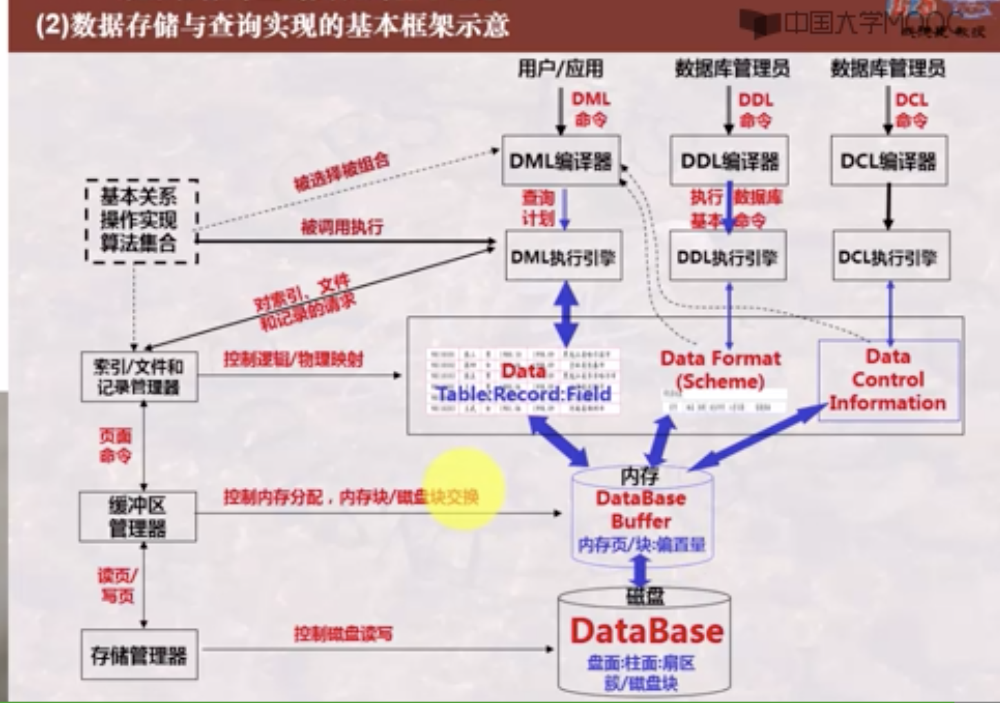
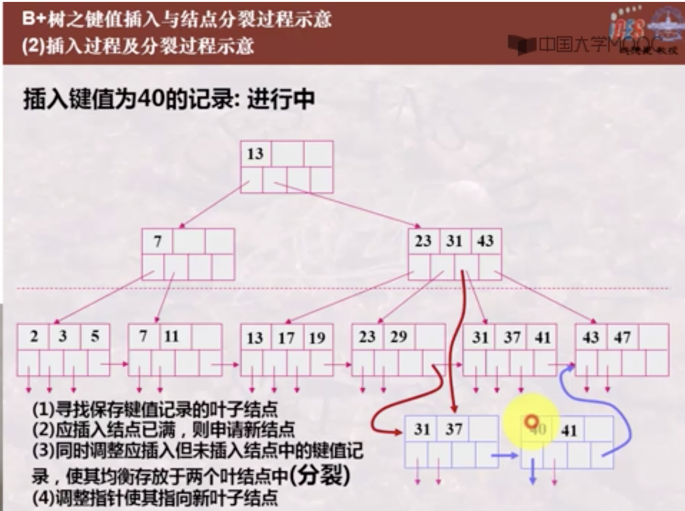
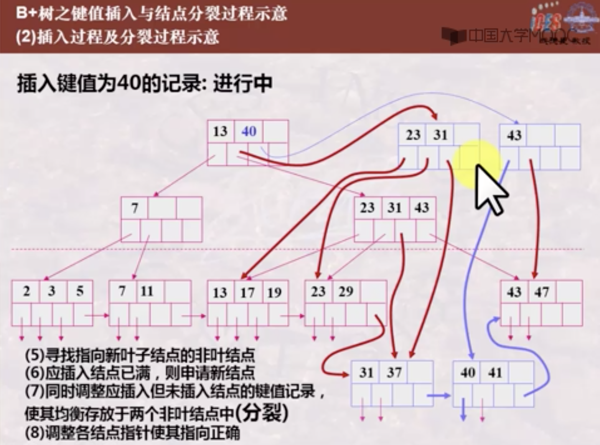

# Database

数据库语言：
- 数据定义语言 DDL
- 数据操纵语言 DML
- 数据控制语言 DCL

数据库语言 -> 编译器 -> 执行引擎 -> 存储

常见数据库问题：
- 编译与执行控制
- 存储与索引
- 查询优化

关系模型 -> 表
层次模型 -> 树
网状模型 -> 图

层次模型和网状模型数据间关联靠指针维系。当关联较为复杂时，比较难以维护。

**候选键** (candidate key): 关系中的一个属性组，其值能唯一标识一个元祖。

**主键** (primary key): 可以从多个候选键中选一个作为主键。

**外键** (foreign key): 是另一个关系的候选键。

数据库完整性

SQL完整性约束规则实现：
- create table
- 触发器 trigger

数据库安全性实现：
- 授权机制
- 视图 （只把特定视图提供给特定用户）

嵌入式SQL： 将SQL嵌入到某一高级语言。

事务：一条或多条SQL语句到执行

事务的特性：ACID

- A：Atomicity 原子性： 事务的一组更新是原子不可分的，要么全做，要么全不做。
- C：Consistency 一致性： 保证事务操作状态是正确的。
- I：Isolation 隔离性： 保证并发执行的事务互不影响。
- D：Durability 持久性： 保证已提交事务的影响是持久的。

ODBC (Open DataBase Connection)
是不同语言应用程序与不同数据库服务器之间通讯的标准。

当应用程序调用ODBC API时，ODBC API会调用具体数据库Driver库函数，Driver库函数则与数据库服务器通讯，执行相应的请求并返回检索结果。

## 数据库物理存储与检索

磁盘 - 盘面 - 磁道 - 扇区

磁盘读写数据时间；
- 寻道
- 旋转
- 传输

RAID (Redundant Array of Independent Disk)
- 并行处理：
  - 比特级拆分
  - 块级拆分
- 可靠性：奇偶校验与纠错

数据库记录在磁盘上存储：
- 定长记录：每条记录长度一定
- 变长记录：靠分隔符区分
- 跨块存储
- 非跨块存储

表所占磁盘块的分配方法：
- 连续分配：数据块被分配到连续的磁盘块上（扩展困难问题）
- 链接分配：数据块中包含指向下一数据块的指针（访问速度问题）
- 按簇分配：簇是若干连续数据块，簇之间靠指针连接
- 索引分配：索引块中存放指向实际数据块的指针

文件组织方法：
1. 无序记录文件：记录可存储于任意有空间的位置，磁盘上存储的记录是无序的。空间浪费 -> 数据库重组
2. 有序记录文件：按某属性的值的顺序插入。溢出文件 -> 数据库重组
3. 散列文件： 把某属性的值，依据散列函数计算其存储位置。溢出桶
4. 聚簇文件：将具有相同或相似属性值的记录存放在连续的磁盘簇中。

## 索引

索引 是定义在存储表基础上，有助于无需检查所有记录而快速定位所需记录的一种辅助存储结构，由一系列存储在磁盘上的索引项组成，每一个索引项又由两部分构成：
1. 索引字段：由表中某一列或某些列的值串接而成
2. 指针：指向记录在磁盘上的存储位置

存储文件是一种辅助存储结构，不改变存储表的物理存储结构。
索引文件组织方式：1. 排序索引文件 2. 散列索引文件

更新操作必须同时更新索引文件和主文件。

索引使检索效率提高同时，也增加了存储空间和维护负担。

在SQL中：
- 当定义了table后，如果定义了主键，系统将自动创建主索引。
- 索引可以由用户在任何属性上创建。

**稠密索引**： 对主文件中每一条记录形成的每一个索引字段值，都有一个索引项与其对应，指明该记录所在的位置。

**稀疏索引**： 对主文件中的部分记录形成的索引字段值，有索引与其对应。

稀疏索引定位记录：（*要求主文件必须按对应索引字段排序存储*）

如定位索引字段值为K的记录：
- 找相邻的小于K的最大索引字段值所对应的索引项
- 从索引项对应的记录进行顺序检索

**主索引**：索引项不指向记录，而是指向记录所在的存储块。即每一个存储块有一个索引项，而不是每条记录有一个索引项。存储表的每一存储块的第一条记录，又成为锚记录。

- 主索引的索引字段值为锚记录的索引字段值，指针指向其所在的存储块。
- 主索引是按索引字段值进行排序的一个有序文件

**辅助索引**：定义在主文件的任一非排序字段上的辅助存储结构。辅助索引是稠密索引。

- 一个主文件仅可以有一个主索引，但可以有多个辅助索引
- 主索引通常建立在主码或排序码上
- 主索引是稀疏索引，辅助索引是稠密索引

**聚簇索引**：索引中临近的记录在主文件中也是临近存储的。反之则为非聚簇索引。

- 一个主文件只能有一个聚簇索引文件
- 主索引通常是聚簇索引（但索引项总数不一定相同）；辅助索引通常是非聚簇索引

**倒排索引**：正排：一个文档包含哪些关键词；倒排：一个关键词包含在哪些文档中

**多级索引**：当索引项比较多时，可以多索引再建立索引，依次类推，得到多级索引。如B树，B+树索引。

### B+树索引

- 能够自动保持与主文件大小相适应的树的层次
- 每个索引块的指针利用率都在50%-100%之间（即只有叶结点的指针有效）

$$P_1-K_1-P_2-K_2-P_3-K_3-...-K_{n-1}-P_n$$

索引字段值x在$K_{i-1} \leq x \leq K_i$，对应指针为$P_i$,
x在$K_i \leq x \leq K_{i+1}$，对应指针为$P_{i+1}$。

- 非叶结点指针指向索引块，叶结点指针指向数据块或记录。
- 叶结点的最后一个指针不同于其他指针，其始终指向下一个数据块。
- 所有叶结点即可覆盖所有键值的索引。
- 索引字段值在叶结点中是按顺序排列的。

B+树是平衡树，因此在插入和删除操作时，伴随着结点的分裂与合并。

B+树键值的插入与删除：
- 插入（结点分裂）：
    

    
    

    

    
    

    3点注意：
    1. 当结点全满时进行分裂
    2. 由叶结点向根结点逐层处理
    3. 指针重新调整
- 删除（结点合并）：
    1. 当结点指针数目小于规定数量时进行合并
    2. 由叶结点向根结点逐层处理
    3. 指针重新调整

**B树**：
- 索引字段值仅出现一次，或者在叶结点或者在非叶结点
- 指向主文件的指针既可出现在叶结点也可出现在非叶结点
- 所有结点才能覆盖所有键值的索引

### 散列索引
- 静态散列索引：桶数是固定的
- 动态散列索引：桶数是动态增加的，如可扩展散列索引，线性散列索引

## 数据库查询实现算法

数据库的三大类操作：
1. 元组的一元操作：selection，projection - 迭代器算法
2. 关系的一元操作：distinct，group by，sorting - 一趟扫描，两趟扫描
3. 关系的二元操作：并，交，差，join，product

迭代器算法：利用关系的迭代器，可以构造该关系对应的选择，投影等操作对应的迭代器。

一趟扫描算法：只要有一个关系可以完全装入内存即可使用。设计要点在于建立不同的合适的内存数据结构，来保存之前处理过的数据，以便快速处理整个关系上的操作。为快速定位一个元组，可以建立如排序结构/散列结构/B+树等实现快速插入、快速查找。

两趟扫描算法：关系无法完全装入内存。两趟分别为：
1. 第一趟：划分子集，使子集具有某种特性，如有序或相同散列值等
2. 第二趟：处理子集，形成结果关系，如多子集的归并排序等

- 内排序问题：待排序数据可一次性装入内存。常用排序算法：快排，冒泡等。
- 外排序问题：待排序数据不能一次性装入内存，需分批装入内存分批处理。

外排序基本策略：
将数据块划分为能装入内存的N个子集合，每个子集合装入内存并排序后重新写回磁盘。
> N个已排序子集合数据怎么进行总排序？ 

**两阶段多路归并排序** (TPMMS: Two-Phase Multiway Merge Sort)
- N个子集各自依次序读取一块装入内存
- 内存中的N块也依次序读取一个元素放入待比较集合
- 将待比较集合中最小元素取出写入输出块
- 输出块依序写回磁盘

基于排序的两趟扫描算法：
1. 划分子表，并进行排序
2. 基于两阶段多路归并排序TPMMS，在归并阶段进行相应操作，如去重，聚集等

基于散列的两趟扫描算法：
1. 根据散列函数将关系划分为多个子表
2. 处理每个子表，用另一个散列函数将子表读入内存

由于进行了哈希，同一分组/重复的记录都在同一子表中，只需对子表进行相应操作即可。

## 数据库查询优化

查询优化可分为三个层次：
1. 语义优化：利用模型语义及完整性规则优化查询（不做讨论）
2. 语法优化：逻辑层优化，优化关系代数执行次序
3. 执行优化：物理层优化，存取路径与执行算法的选择

### 语法优化
- 改变关系代数的操作次序，如尽可能早做选择和投影运算
- 次序改变前后表达式等价问题

逻辑层具体优化策略：
1. 尽可能早做选择和投影
2. 可以把选择和投影串接起来，即只对关系扫描一遍
3. 可以把选择操作与其前的笛卡尔积合并为连接操作
4. 找表达式中公共子表达式

关系代数操作次序的等价性：
1. 连接与连接，积与积的交换律
2. 连接与连接，积与积的结合律
3. 投影，选择串接律
4. 选择和投影的交换律
5. 投影/选择和积的交换律
6. 投影/选择和并的交换律

### 执行优化
- 为每个关系代数操作选择算法并进行装配
- 对每个物理执行计划/执行方案，进行代价估算，选择代价最小的

评估好坏需要考虑的因素：
- IO访问次数、 CPU的占用时间、内存使用代价、 计算量等。
- 如果是分布式数据库，还需要考网络通信代价。

物理查询运算符：通常是关系代数操作的一个特定实现

## 数据库事务处理技术

事务处理技术主要包括：
1. 并发控制
2. 故障恢复

**事务**（transaction）：
数据库管理系统提供的控制数据操作的一种手段，通过这一手段，能将一系列数据库操作组合在一起作为一个整体进行操作和控制，以便提供一致性状态转换的保证。

事务的特性：ACID
1. 原子性 Atomicity：要么全做，要么全不做
2. 一致性 Consistency：避免出现三种典型的不一致现象（丢失修改，不能重复读，胀读）
3. 隔离性 Isolation：并发执行的多个事务互不影响
4. 持久性 Durability：已提交事务的影响是持久的，被撤销事务的影响是可恢复的

### 并发控制

并发控制：就是通过事务微观交错执行次序的正确安排，保证事务宏观的独立性，完整性和正确性。

并发调度的正确性：当且仅当在这个并发调度下所得到的结果与分别串行地运行这些事务所得的结果完全一致，则说调度是正确的。

当一个调度是冲突可串行化，那一定满足并发调度的正确性。

**冲突**：如果交换顺序，行为会有所改变。

冲突可串行性判别算法：
- 构造一个有向图
- 结点是一个事务，如果事务a的一个操作与事务b的一个操作发生冲突，且a在b之前执行，则a指向b
- 如果图中没有环，则其为冲突可串行化的

> 怎样产生一个正确的并发调度 -> 怎样产生一个冲突可串行化的调度？
1. 基于锁的方法
2. 基于撤回的方法

**锁**：锁是为了提供控制的手段，其本身并不能保证冲突可串行性。

锁的类型：
- 排他锁：只有一个事务能读写，其他任何事务都不能读写
- 共享锁：所有事务都可以读，但任何事务都不能写
- 更新锁
- 增量锁

封锁协议需要考虑：
- 相容性矩阵
- 加锁/解锁时机
- 封锁粒度：属性，元组，关系等

**两段封锁协议** 2PL (two-Phase Locking protocol):
- 读写数据之前要获得锁
- 两阶段：加锁段，解锁段。加锁段中不能有解锁操作，解锁段中不能有加锁操作
- 每个事务中所有加锁请求先于任何一个解锁请求

两段封锁协议是可能产生死锁的协议。

基于撤回的方法：
- 基于时间戳的并发控制
- 基于有效性确认的并发控制

简单的基于时间戳的并发调度规则：
- 对每个数据元素x，保留其上的最大时间戳
  - RT(x)：最后读x的事务的时间戳
  - WT(x)：最后写x的事务的时间戳
- 事务启动时的时间戳 TS(T)

相应规则：
事务T读x，将事务时间戳与WT(x)比较：
- TS(T)大，允许操作，并更新RT(x)
- TS(T)小，有冲突，撤回T，重启T

同理，事务T写x，也需考虑时间戳。。。

基于有效性控制的调度：（待补充）
- 事务启动时的时间戳
- 每一事务读写数据的集合

### 故障恢复

数据库的故障类型：
- 事务故障： 事务运行错误（通过撤销和重做进行恢复）
- 系统故障： 断电，非正常关机等
- 介质故障： 磁盘损坏等

故障恢复：把数据库当前不正确状态恢复到正确的某一状态。需保证事务的原子性和持久性。可以通过重做事务和撤销事务来恢复。

> 系统故障恢复

**运行日志**：以流水方式记录每一个事务对数据库的操作及操作顺序，当事务对数据库进行操作时，会先写运行日志。

系统故障可以通过运行日志恢复 -> 从哪一个时间点开始恢复？

**检查点**：代表某一时刻，数据库管理系统强制使内存中内容与介质后者能够内容保持一致。

通过在日志中定期设置和更新检查点，可以从检查点开始进行恢复。

>  介质故障恢复

副本：冗余来保证数据可恢复。
用副本恢复后，还需要根据转储点时间依据运行日志进行恢复。

日志：
- undo型日志：先将更新前的值写入日志；将新值写入磁盘；提交或撤销信息写入日志。
- redo型日志：先将更新后的值写入日志；提交信息写入日志；写入磁盘。
- undo/redo型日志：现将更新前和更新后的值写入日志；写入磁盘及将提交信息写入日志（顺序无要求）。

